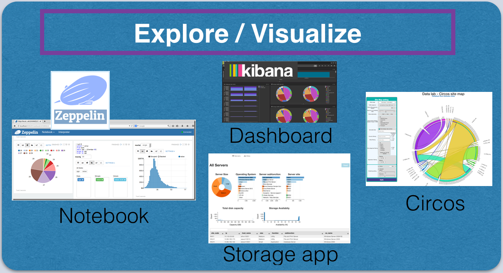
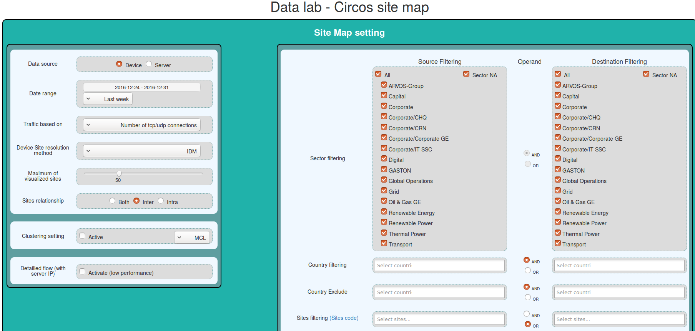
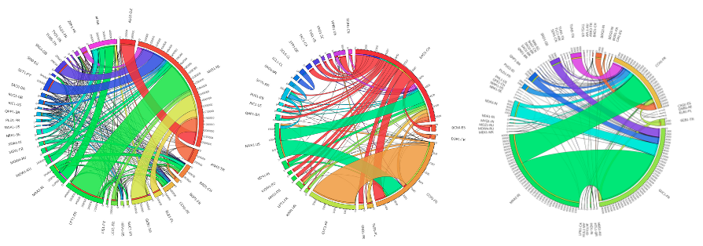
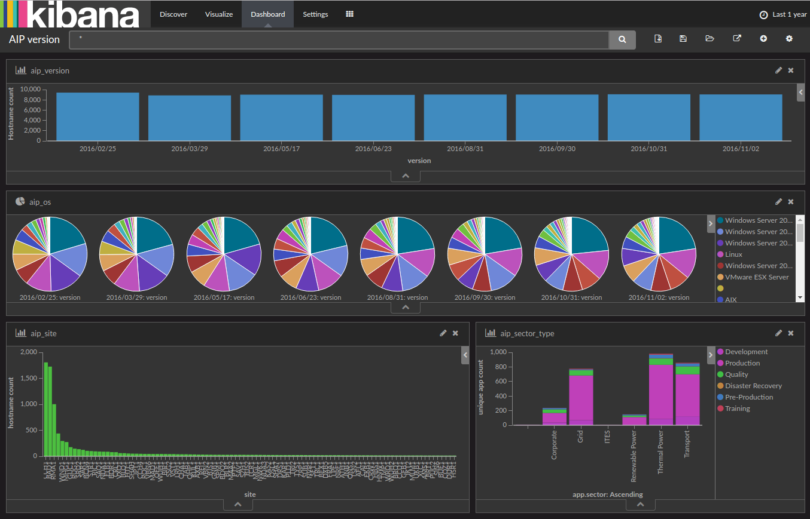
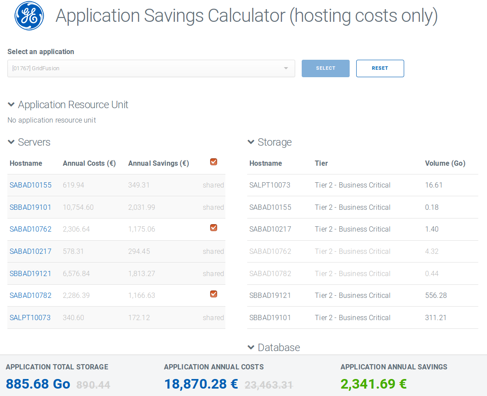
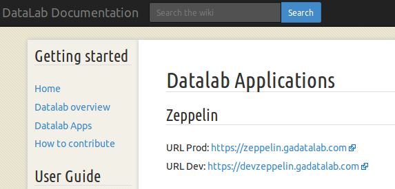

<<<
== Data Consumer Applications

// Infra : création des clusters et applis : big picture du ppt + contenu fichier README du répertoire infra

// * description des applis (circos, zeppelin (dev et prod), serverusage, kibana, wiki, https://s3.gadatalab.com/saving_webapp/latest/app/index.html#/by-application)
// * description des zeppelin (dev, prod) + help + description repo github associé(zeppelin-notebook)  (avec branches dev et prod)
// Lets speak about
// Test applications ....
// Des applications ( - circos - serverusage - kibana - zeppelin - wiki )

=== Applications

In Datalab project we use some web applications in order to consume collected or prepared data.
These are _Apache Zeppelin_ , _Circos_, _Kibana_, _Application Savings Calculator_, etc...

Once collected data from different sources are prepared and ready, we use these web applications to consume them.
Mainly, they allow us to visualize analysis results for various purposes.

<<<
=== Zeppelin

As it is said on its official web site, "_Apache Zeppelin is a web-based notebook that enables interactive data analytics"_.
It is possible to make beautiful data-driven, interactive and collaborative documents with SQL, Scala and more.
Please see the figure below for different types of paragraph created under a zeppelin notebook.
We are able to explore data analysis results in various ways, graphics, diagrams, etc.

image::images/zeppelin_notebook.png[title="Zeppelin notebook", width="600", align="center"]

There are two Zeppelin environments on Datalab project.
Main analysis are done on the devZeppelin.
Data results are then used on some prodZeppelin notebooks.

[options="header"]
|===
|Environment | URL to access
|Development | https://devzeppelin.gadatalab.com[devzeppelin.gadatalab.com. ]
|Production | https://zeppelin.gadatalab.com[zeppelin.gadatalab.com. ]
|===

// _Zeppelin on GITHUB_
// _Help notebooks on DEV ZEPPELIN_

// image::images/devzeppelin_help.png[title="Zeppelin notebook", width="400"]

// ==== Zeppelin in Datalab
// image::images/devzeppelin_helps.png[title="Zeppelin notebook", align="center"]
// ==== Devzeppelin && Production Zeppelin

<<<
=== Circos

Circos is one of the Datalab own applications.
Its main advantage is to display the data flow between devices or servers.
A detailed user interface allow to refine the result by filtering by date, sites, sector, country, etc...
The following screenshot from Circos application shows how data can be filtered before visual graphics are generated.

This application is mainly dedicated to carve-out use case.
See the following chord diagrams which show data flow between different sectors.

It visualizes relationship between sites and extracts flows.

* from device (laptop/desktop) to servers (windows/unix/linux)
* from servers (windows 2003 and later version) to servers (windows/unix/linux)

https://circos.gadatalab.com/[Access to circos application. ]

<<<
=== Kibana

Kibana is another web based application used with Elasticsearch in order to create _dashboard_ visuals in real time.

https://kibana.gadatalab.com/[kibana.gadatalab.com. ]

<<<
=== Application Savings Calculator

This simple application lets un know the cost of each resource such as storage, data base server, application server, etc.. on which one or multiple applications are installed.
It is very useful to calculate the annual savings in case of a server decommission.

Data consumed by this application come from SEO/AIP or from billing reports.
In this application all data are fetched only once from the server side, while it is loaded and all calculations are done on the client side.

https://s3.gadatalab.com/saving_webapp/latest/app/index.html[Access to circos application. ]

<<<
=== Datalab Wiki

Access to the Wiki of Datalab is through : https://wiki.gadatalab.com[wiki.gadatalab.com. ]

This Wiki gives an overview of the Datalab project, helps to know briefly which are applications used on this project and provides access URLS to them.

You can find some paths to the main repositories on S3 or HDFS in wiki.

