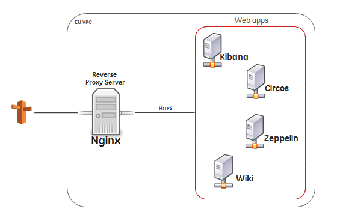
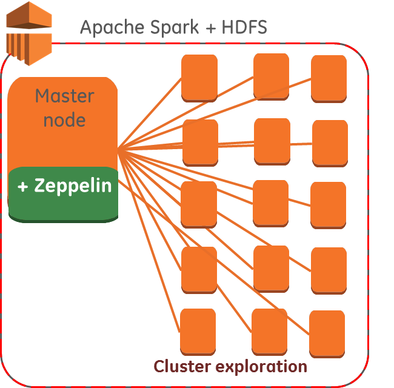
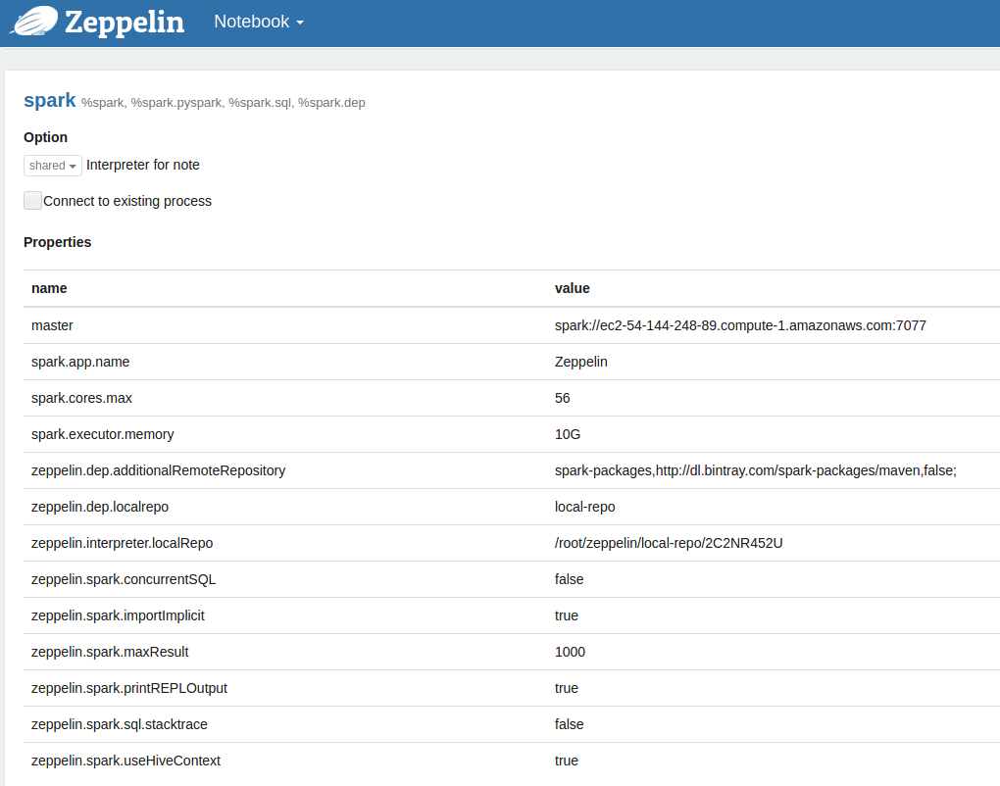
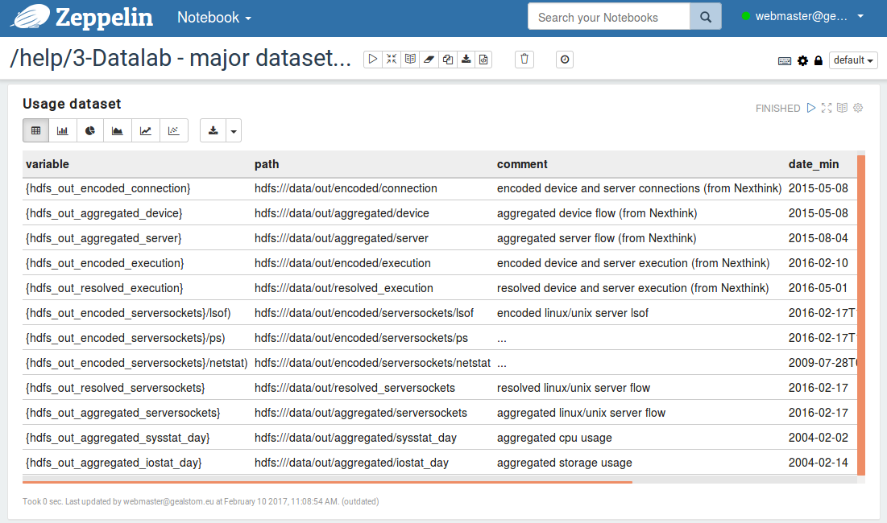
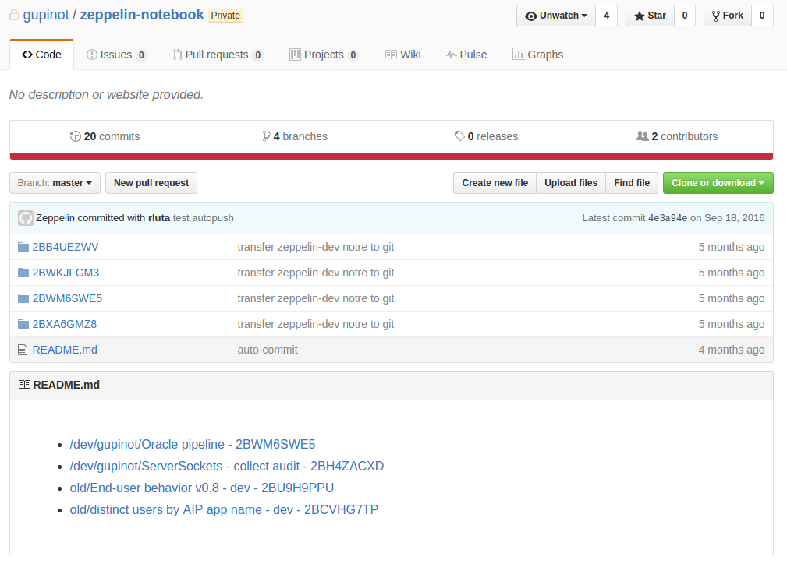
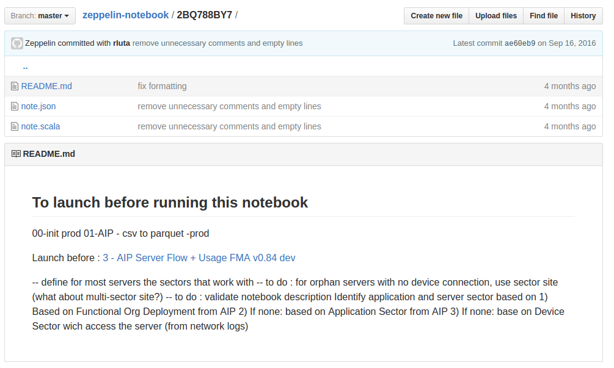

<<<
== Datalab Project Applications

=== Reverse Proxy Server

In Datalab project we use different web applications in order to consume collected data, do analysis, print visual reports, etc...
As you may view on the following illustrated figure, we created a web reverse proxy server which provides secure assess to these applications.

<<<

=== Zeppelin

Zeppelin needs to be connected to Apache Spark compute engine which helps to use Hadoop data.
Zeppelin is deployed on the same instance of the Master node.

There are 2 Zeppelin environments (dev, prod) in Datalab project.

==== Backend architecture

As you can see on the following figure, we use about 12 slave node instances in _m1.xlarge_ format on AWS with a single _Master node_ on which Zeppelin is also installed.

==== Apache Spark configuration

Spark interpreter must be configured on Zeppelin before being able to use it.

==== Major data sets' path and summary - Help notebooks

In the _help_ folder under dev-zeppelin, we collected some important notebooks in which we describe _notebook organisations_,
_guidebook_, _tutorials_, _description of major data sets_, etc...

<<<
==== Notebooks

There are many notebooks created and will be created on both Zeppelin environments.
Those notebooks contain different types of code in various languages such as _Bash_, _Spark_, _Scala_, _SQL_, etc..
On the one hand they are part of Datalab project development, on the other hand we don't want to loose them if any accident takes place on AWS servers.
This is why we store them in a private repository on Github.

Each Zeppelin notebook content is stored inside of a folder named with its ID (ex: 2BB4UEZWV).
As this doesn't allow us to identify the name of the notebooks when we want to restore or import/export them from one environment to the another,
we created a link to each notebook folder with its proper name/title.
As you can see on the following figure, there is a link for each notebook on the zeppelin-notebook repository's home page on Github.

Notebooks on Zeppelin-dev are stored on a private Github repository.
It allows to store each notebook in JSON format and be able to track the changes done on them.

=== Zeppelin dev cluster (master + slaves) nodes example

* zeppelin-dev-master-i-981ad300 - m1.xlarge - ec2-54-144-248-89.compute-1.amazonaws.com
* zeppelin-dev-slave-i-0518d19d - m1.xlarge - ec2-54-152-169-50.compute-1.amazonaws.com
* ....
* zeppelin-dev-slave-i-cb18d153 - m1.xlarge - ec2-54-162-212-28.compute-1.amazonaws.com

=== Zeppelin prod cluster (master + slaves) nodes example

* zeppelin-prod-master-i-bca7cb22 - m1.xlarge - ec2-54-87-132-205.compute-1.amazonaws.com
* zeppelin-prod-slave-i-1ea6ca80 - m1.xlarge - ec2-54-227-226-162.compute-1.amazonaws.com
* zeppelin-prod-slave-i-65a5c9fb - m1.xlarge - ec2-54-234-214-124.compute-1.amazonaws.com
* zeppelin-prod-slave-i-66a5c9f8 - m1.xlarge - ec2-54-234-193-221.compute-1.amazonaws.com
* zeppelin-prod-slave-i-7fa5c9e1 - m1.xlarge - ec2-54-234-192-94.compute-1.amazonaws.com

=== Create cluster on AWS

In order to create HDFS file system with master and slave server instances on AWS, you need to referrer to the ./infra/README.md file.
Either for production or development environment, the detailed command line code is given on that file as below:

[source]
.infra/README.md
----
include::../infra/README.md[lines=24..29]
----

Keep in mind that the master IP will be changed if the HDFS architect is re-created.
You need then associate this IP with _dev.zeppelin_ or _zeppelin_ so that these platforms could be reachable.

[source]
.infra/README.md
----
include::../infra/README.md[lines=26..26]
----

// === Connection
// ssh root@ec2-174-129-93-119.compute-1.amazonaws.com

