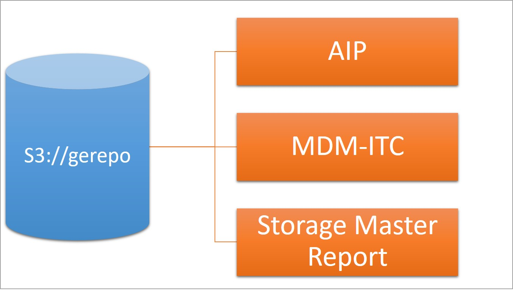
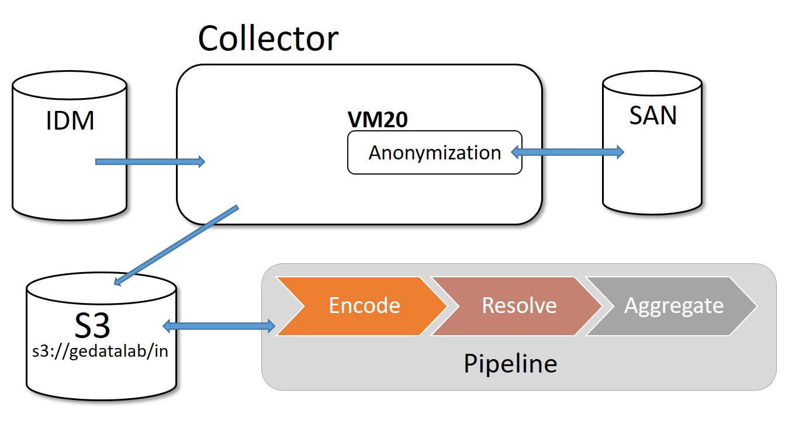

= DataLab

== References

In this project we have 3 main types of referenced data collection.
These are _AIP_, _MDM-ITC_ and _Storage Master Report_ which are kept on s3.

=== AIP

_AIP_ is data reference to list of servers and applications installed on them.

There are 3 main tables which are :

* _server_: list of all servers
* _application_: list of all business applications
* _softInstance_: which application is deployed on which server

Data is synchronized daily by batches and they are stored under s3://gerepo/.

Zeppelin notebook URLs are

* https://devzeppelin.gadatalab.com/#/notebook/2BMCK757N
* https://devzeppelin.gadatalab.com/#/notebook/2BXZ39CTF

=== MDM-ITC

This is the network topology which gives us any information about network elements. 
As an example, we are able to know what are the _IP ranges_ for a given _site_ thanks to these information.
These data are intended to be manually transferred into s3://gerepo/in/mdm-itc.

include::doc_storagemaster.adoc[]

NOTE: _IDM_ is the management of individual identities/users, their authentication, authorization,
roles and privileges within different sites, sectors, teams etc.

include::doc_introduction.adoc[]

include::doc_nexthink.adoc[]

include::doc_serversocket.adoc[]

include::doc_serverusage.adoc[]

include::doc_pipeline.adoc[]

// It is important to know that there is
// Apart from +ing, ..... may also be required
// To know more about ....., look into/check out
// However, ......
// It goes beyond the bounds of all other forms of professional +ing..
// Like ....., ..... is one of the most .... ....

// == Oracle log files

// While other data sources collected or transferred regularly, Oracle log files are collected only once. 
// CSC provides us log files which are available. 

/// ou est-ce queles donnnes sont stockés.
// quelles sont les inputs
// que fait on ?
// quel est le code
// ou est stocké le sortie
//

// 

