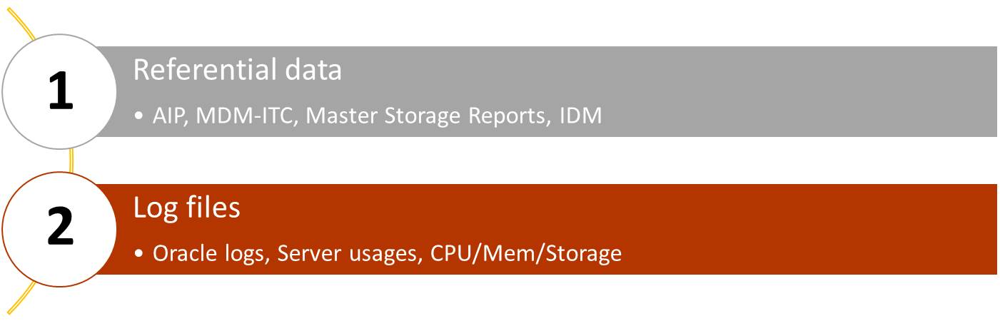
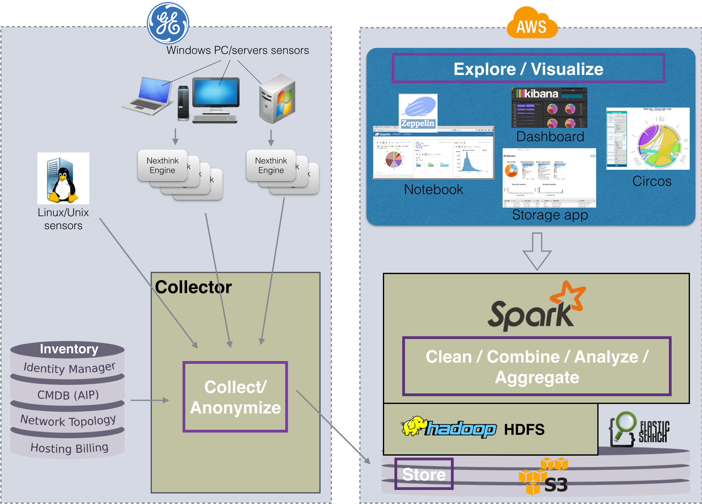

<<<
// == Key points for this doc

// * Put more information as we can to make the subject clear enough. 
// * Make it readable, visually clear. 
// * Use different colors to show how different kind of collect data sources are used in various cases. 
// * Where the data come from, from where they pass and where it stored. 
// * If it is red then it is used by Zeppelin, if it is blue then it is used by pipeline. 
// * for pipeline, represent how data is kept during different steps of the pipeline. 

== Presentation of DataLab

The main purpose is to build coherent repositories and map them with logs to simulate IT in a digital way.
While these repositories are _theoretical view_ of the IT, asset's logs are real _usage view_.

// Let's talk about what are different kind of data that we analyse.
As result, _Referential data_ (AIP, MDM-ITC, Storage Master Reports, IDM) and
usage logs (Nexthink, Server-sockets, Server usage, Oracle logs) are collected data on which we are mainly focused to do analysis.

This figure represents global view of the project.
Data collection is shown on the left side.
Referential data and logs are collected and anonymized on the Collector server before storing them under s3.

On the right side, we see what are technologies used to store, combine, analyse, aggregate data and
how we finally visualize analysis reports via various programs, such az Zeppelin, Circos, etc...

// Let's talk about data sources to collect
// === Referential
// image::images/global_view1.png[title="Global view of the project", width="450", height="100", align="center"]
// === Log files
// Let's talk about, what we are going to speak in this project.

// etc..

