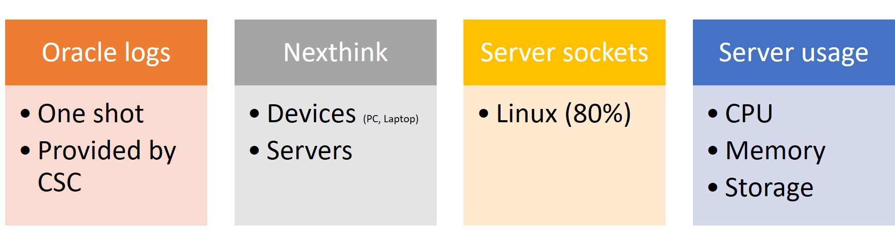

<<<
// == Key points for this doc

// * Put more information as we can to make the subject clear enough. 
// * Make it readable, visually clear. 
// * Use different colors to show how different kind of collect data sources are used in various cases. 
// * Where the data come from, from where they pass and where it stored. 
// * If it is red then it is used by Zeppelin, if it is blue then it is used by pipeline. 
// * for pipeline, represent how data is kept during different steps of the pipeline. 

== Types of data sources to collect

There are different kind of sources that we collect to analyse.
These sources are :

* Oracle logs
* Nexthink
* Server sockets
* Server usage

_Oracle logs_ are database access log files.
_Nexthink_ is the application which collects data about network connections, program executions, web requests, etc. from PCs, laptops or servers.
While Nexthink is mainly applied on Microsoft Windows systems, _Server sockets_ is implemented for Linux based machines.
Finally, _Server usage_ is data collection from servers, including their CPU, memory, storage usages, etc.

