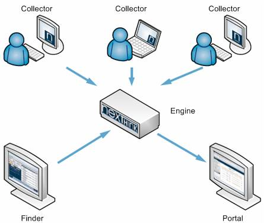
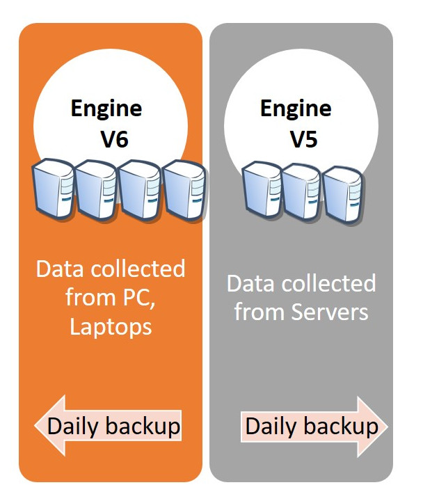
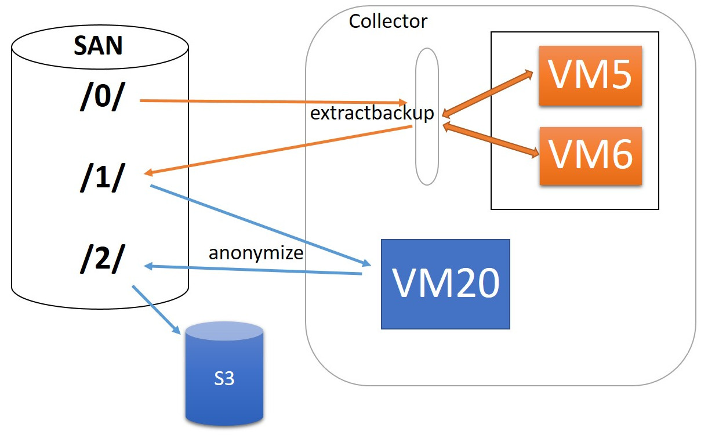

<<<
== Nexthink

=== What is Nexthink ?

Nexthink is the application which collects information about any actions done on a PC, Laptop or a server.
See image below.
footnote:[https://doc.nexthink.com/images/a/a3/Collector.png]

A Nexthink _Collector_ program installed on different devices captures network connections, program executions, web requests, etc.. and sends data to Nexthink _Engines_.
Nexthink _Engines_ stock received data and make daily backups.

=== Where are data collected on Nexthink side ?

There are two groups of Nexthink servers on which collected data are stored.

* _Data collected from PCs, laptops, etc._ There are 21 servers and the version of Nexthink installed is V5.

* _Data collected from Servers_. There are 3 servers in this group. The version of Nexthink is V6.

As a result, data storing and backup processes are different on both kind of engines/servers.

WARNING: Furthermore, archived data aren't kept for a life on backup servers.
As soon as more data are coming, the very old once are erased.

=== List of servers

The following CSV files contain the list of hostnames of the nexthink backup servers:
_engine_amer.csv_, _engine_asie.csv_, _engine_eur1.csv_, _engine_eur2.csv_, _engine_server.csv_.
They are located under _/collect/nexthink/0/bin/_ folder.

[source,csv]
.collect/nexthink/0/bin/engine_eur1.csv
----
include::../collect/nexthink/0/bin/engine_eur1.csv[lines=1..5]
----

=== How collected data are transferred on our side ?

There is a single archive file per nexthink backup server.
Each file can contain log history of 5 to 20 days.
Here is a picture of list of archived files copied from nexthink backup servers.

image::images/nexthink_archives.jpg[title="Archive files on the collecter server copied from nexthink backup servers"]

We use _scp_engine.sh_ script to copy archived data from a nexthink backup server to the collector (SARMA10012) server.
This can be done manually per hostname by : _./scp_engine "hostname"_

[source,bash]
.collect/nexthink/0/bin/scp_engine.sh
----
include::../collect/nexthink/0/bin/scp_engine.sh[lines=1..15]
----

However, _dump_all_engine.sh_ script is written to execute copy process for a all of servers in a CSV file.

[source,bash]
.collect/nexthink/0/bin/dump_all_engine.sh
----
include::../collect/nexthink/0/bin/dump_all_engine.sh[lines=14..19]
----

Finally, a cron table definition is implemented in order to run data copy in about every 3 days.

[source,markdown]
.collect/nexthink/0/crontab/my_cron
----
include::../collect/nexthink/0/crontab/my_cron[]
----

NOTE: As we try to collect these data every 3 days in order to not loose any part of them, this causes us some overlaps.
This is why we should make attention to filter duplicated data during analysis processes.

==== How input data are used ?

Provided data stored under SAN server in */0/ folder* are considered as _input data_.
As they are collected by Nexthink way, they are not in any columnar format (CSV, parquet, etc.).
This is why the very first step is to extract these data into CSV format with the help of a Nexthink environment.
We have 2 virtual machines (named as VM5 and VM6) on the Collector server which are dedicated to this purpose.
VM6 is used to extract data collected from servers and VM5 for the rest.

==== Extract-backup

Input data are deployed either on VM5 or VM6 to be extracted.
We use NXQL sql requests to extract information and we store them in CSV formats.
This operation is executed daily and we call it as _extractbackup_.

Extracted data are copied on */1/ folder*.
At this stage, they are ready to be anonymized.

//Finally, extracted data is anonymized via VM20 and stored on s3://collect/nexthink/in.

After extracting, we separate 3 data types under /1/ folder.

* _connection_ - anything related to users' "connection" (TCP, UDP, etc..)

NOTE: A connection is a link between a device and a destination through the use of network resources. There are two types of connections depending on the transport protocol used for communication:
_TCP_: The connection has a status. _UDP_: The connection is stateless.

Information collected about any outgoing (and only outgoing) network requests,
such as which user is connected, by which application,
IP address requested, HTTP protocol used, server port number,
request execution time, request content size, etc.
These information are mainly related to the source device of the requests.
It can be a simple user machine but also a server.

* _webrequest_ - anything related to a "webrequest" (DNS information)

NOTE: A web request is a message sent from a client application to a server using the standard web protocol HTTP or its secure version over TLS.
Nexthink is able to record not only the web requests of web browsers, but of any application that runs on the device of the end-user.

This kind of data are captured while a web request (HTTP) is detected.
Some information about the target device is collected, such as request's DNS address (google, etc.), etc.
However, full URL of web requests are not registered at all.

* _execution_ - anything related to an application "execution"

NOTE: An _execution_ is an activity that indicates the loading of a binary into the memory of a computer to run it as a separate process.

These are information about the execution of any application used by users.
This concern also applications which do not access to internet.
(even if a user doesn't login to the application).

These kind of data give us information about which application is executed,
by which user, at what time, the version of the application,
how much does it take to be started, the path to the application, etc.

As a result, there are 3 main folders ( _/connection_, /_webrequest_, /_execution_) under s3 server
for each of these types of data collections.

//[TIP]give a picture from cyberdock with highlighted colors of these folders.

=== Anonymization

The next step in the process is to make anonymous some user information from extracted data.
As usual, we use virtual machine VM20 for this purpose.
Once done, we store them under /2/ folder on the SAN server in CSV format.

Finally, these data are copied to _s3://gedatalab/in._

Source code path: ALDatalab/collect/nexthink.