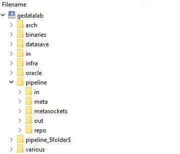
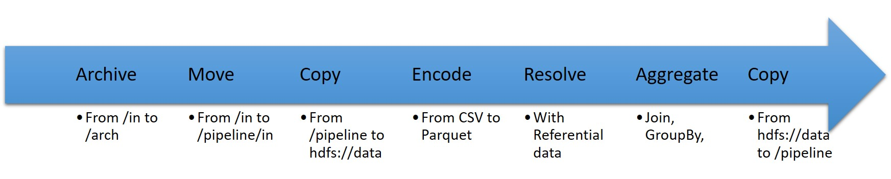

<<<

== Pipeline

// What is pipeline ?
// Why ?
// Who do that ?, What is pipeline ?,
// Why this pipeline ?,
// When it is used and when it is done ?
// Where are stored pipeline source code ?
// Where are stored information after each step ?
// The input data is stored on s3 under s3://gedatalab/
// How it is done ? By which way ?

There are 3 main processes that we need to apply.
These are _encoding_ of collected data from CSV format into "parquet" format,
_resolving_ them to get complete data and _aggregating_ to
get some analysis results.

* _Enconding_ :

Collected data are in CSV file format and stored in s3://gedatalab/.
We need to encode them in "parquet" format in HDFS file system.
This will improve data manipulation performance compared to CSV format.

* _Resolving_:

This is the resolution of encoded data by combination with other referential information.
As an example, we can re-define a user's sector, site or its team name with the help of resolve methods.
This process is intended to find specific information from multiple tables.
We can find for example _the number of connections_, _the number of distinct users_, _the number of distinct devices_,
_the network traffic volume_, etc..

* _Aggregation_:

This is simply aggregation of data, which may be done daily, monthly, etc.
// - Aggregate is to join tables with reference tables and if needed to group by.

The input data are stored in s3://gedatalab/.
They are then deployed to HDFS file system, encoded, resolved and aggregated.
Data output from each of these steps are kept and stored on s3, so we can use any of them at any time.

There are 3 main folders which are /_encoded_, /_resolved_, and /_aggregated_.
We store data in these folders after each main step.
Each of these folders contains three sub-folders for different types of data (nexthink, server-usage, server-socket).
Once we finished data manipulation we store them again on the s3 server for future use.

We execute these processes in a Pipeline.
It is execution of various batches on a cluster.

// (This "Resolve" process is also done for "oracle logs" but it is done on Notebook)
// [TIP] give a screenshot of what is in the cyberduck for s3://gedatalab

<<<
=== Pipeline folder structure

We organized folder structure of pipeline process as below:

* _/gedatalab/in_ - contains newly stored data coming from collector server.
* _/gedatalab/pipeline_ - is the main folder to keep all kind of data used during different steps of pipeline actions.
* _/gedatalab/pipeline/in_ - will be used to keep default input data for pipeline.
* _/gedatalab/pipeline/done_ - folder is used to keep output data.
* _/gedatalab/pipeline/meta_ - is dedicated to store meta-information about _nexthink_ data.
* _/gedatalab/pipeline/metasocket_ - folder is used to store server socket meta-data.
* _/gedatalab/pipeline/repo_ - folder is used to achieve "resolve" processes. I-ID are stored under this folder.

// NOTE: There is no meta-data information for server-usage to keep under s3 because there is no much risk of duplicate data on _server-usage_ compared to _nexthink_ and _server-socket_.

// What is the quantity of the information used ?
// How much can it cost us ? etc ?

=== Pipeline main actions

[source,bash]
//[%autofit]
.collect/oracle/bin/main.sh
----
include::{sourcedir}/src/universal/bin/pipeline.sh[lines=46..62]
----

. Make an archive of the s3://gedatalab/pipeline to s3://gedatalab/arch.
. Move data from s3://gedatalab/in to s3://gedatalab/pipeline/in
. Make a copy of data from s3://gedatalab/pipeline to hdfs://data/.
. Data in HDFS is encoded, resolved and aggregated.
. Replace (or erase) s3://gedatalab/pipeline with data in HDFS, hdfs://data/.

We need to deploy data on a distributed file system in cluster if we want to analyse them.
This is why we use s3 to keep data, but hdfs://data (on Amazon EC2) to manipulate or do analysis on them.
While working on Zeppelin notebooks, it is also possible that the data are already deployed on HDFS file system on a previous Zeppelin paragraph.
In this case, we can directly use them.
Otherwise, we need to deploy data from s3 to HDFS.

// Another goal is to get reduced size of Dataset in order to make them easily analysable with Zeppelin.

Note that it is also possible to access on the output data of each state realised in the Pipeline.
As an example, resolved data are stored on the _resolved_ folder which can be accessed and used at any time.

Pipeline source code is under _/src/main/scala/_ folder in project.

=== Compared to Oracle log file analysis

While we analyse Oracle log files we don't use Pipeline processes.
However, almost all of these processes are also applied to Oracle log file analysis.
But all are done on Zeppelin notebooks.

