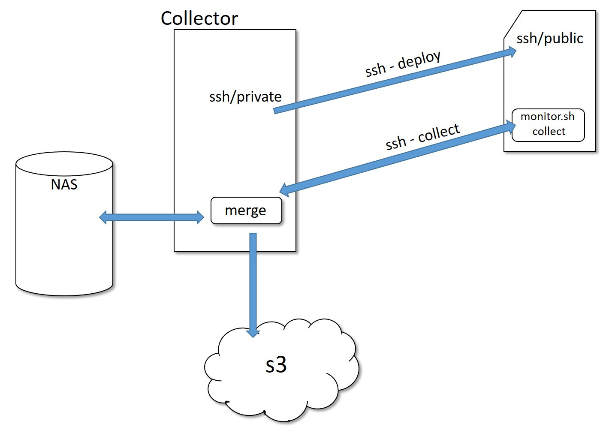

<<<
== Server sockets

This simple project is implemented to collect data from linux-based machines as nexthink works only on windows based machines.
We look for information about what is executed or accessed and what are processes invovled by these accesses.

Source code path: ALDatalab/collect/serversocket

=== Deployment

A datalab user account is created on about one thousand linux servers. 
A pair public/private key generated for each of them and public keys are deployed on these servers.
Then we connect to the servers with ssh and deploy _monitor.sh_ script on them.
This script executes linux commands such as "netstat, ps, lsof, etc." every 5 minutes and puts results into server-usage data files.
It is activated with a crontab.

=== Collecting data

Collector server gets files from servers and put them on the NAS server.
As there are so many small files, we merge them into larger files before putting on s3://gedatalab/in/serverusage.

=== Anonymization
Like _Server usage_ data there is no anonymization process for _Server sockets_.

