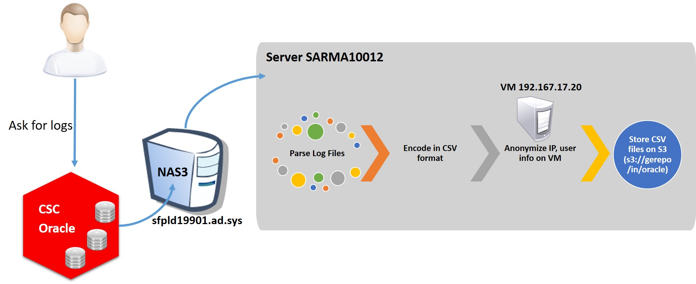

Enterprise IT Digital twin
BAYRAMOV Matin
bayramov.matin-ext@power.alstom.com
v1.0, 2016-10-10
:pdf-page-size: A4
:imagesdir: images
:icons: font

== Project
The main purpose of this project is ....

== Collection of DB access log files
As Alstom, we ask to CSC to provide us Oracle DB log files.
They give us archived log files recorded by different listeners.

There is a zip file per server and its instances.
These log files give us many information about the source of Data Base requests, the kind of source devices such as
physical user machine, proxy server, etc.

There are many variety on the location of the servers and on their timezones.

The convention used to name these files is name of the server and instances to which they belong.
As an example, the following archive file contains line of logs recorded from "Server ServerName and Instance 2":

[TIP]
LISTENER_ServerName_Instance1_logs.zip,
ex: listener1_sabad19305_IM1.zip, listener_acch15624_MW2.zip

== Provided access logs organization
We organised files by respecting to the following folder structure.

* "in" folder is mainly used to keep source files.
* "out" folder is used to save output data
* "done" folder is intended to save data once all processes are finished.

Once archived files put on the server for the first time, we move them inside "/in" folder.
At the end of the script all data files are stored in NAS3 server.

== Transferring files from remote server
Second phase of the process is done on the collector server.
Archived log files are securely transferred from NAS3 server to the local server.

This is done by get_from_remote() function.
It is in main.sh script file which is under _collect/oracle/bin/_ folder

.collect/oracle/bin/main.sh
[source, shell, numbered]
function get_from_remote() {
	#move remote files to local
	for fic in $(ssh $REMOTE_ORACLE_LOG_USER@$REMOTE_ORACLE_LOG_SERVER "cd $REMOTE_ORACLE_LOG_DIR_IN; ls *.zip 2>/dev/null")
	do
		echo "fic : $fic"
		scp -p $REMOTE_ORACLE_LOG_USER@$REMOTE_ORACLE_LOG_SERVER:$REMOTE_ORACLE_LOG_DIR_IN/$fic $LOCAL_ORACLE_LOG_DIR_IN &&\
		ssh $REMOTE_ORACLE_LOG_USER@$REMOTE_ORACLE_LOG_SERVER "mv $REMOTE_ORACLE_LOG_DIR_IN/$fic $REMOTE_ORACLE_LOG_DIR_DONE/$fic"
	done
}

Then, these archived (.zip) log files are parsed via pars_in() method.

image::images/dl_oracle_sarma.jpg[caption="Figure 1: ", title="Global view of the process", width="800", height="340"]

== Encode files in CSV format
User datalab:

Log files information is parsed by bash script and encoded in CSV format.
It is done by the help of the pars_in() function.
Then we put them on S3 server.

(User nexthink:)

A single Virtual Machine is dedicated to anonymize the received data.
Any user information, device IDs, machine IPs are anonymized.

Access to the virtual machine which realise this operation is permitted by ssh connection.
{ssh datalab@192.167.17.20}

== Anonymization
Log files contain user access information and host name of the source devices.
In order to preserve anonymity of the information we need to anonymize them before storing them in S3 server.
This process is done in VM ubuntu with IP 192.167.17.20.
Fields source.user and source.host.name anonymized to I_ID_U and I_ID_D.

Results are exported in .csv.gz format and sent to the S3 server under s3://gerepo/in/oracle repository.

== Virtual Machine - 192.167.17.20

TODO VM20

== Data manipulation
A Zeppelin notebook with the name "40 - Oracle pipeline" is used to analyse these data.
The main action taken in this part is to encode CSV format files into "parquet" columnar format and restore
them under s3://gerepo/out/oracle.
The goal is to run various actions, such as search, filter, join, etc. more rapidly.

== Date time format correction
As experience, we noticed that some columns' information in these log files don't have the same format.
As the requests are received from different time zones, log files contain various date time formats.
This is an issue because this will not give us correct search or filter results.
In order to resolve this problem, we try either to convert or exclude them.

== Resolves (IP, Mdm-Itc)
In this part, we try to resolve source IP address of the registered flux.
Because we anonymized some important information before analysis.
As an example, it is important now to find out the source mdm-itc "site" of the requests.

However, some site, sector and teranga information is not always correctly reached as
the requests are not only done from physical users machines but also from servers.

Finally, results are written to HDFS file system under hdfs://data/temp/oa_oracle_join

.source code ex: Parse file list to process
[source,scala]
----
case class op_oracle_ca(dir: String, file: String, server: String)
----

== Date time interval precision
Our goal is to analyze line of access logs which are recorded during a specific date interval.
This is why we ask to provider units to give us log files for those intervals.
However, we notice that archived log files contain logs which are out of the date interval.
Corrupted data will not perform a good analysis results.
This is why we should ensure the percentage of the lines which contain corrupted date time formats.
And then we need to either correct them or exclude from the analysis.

